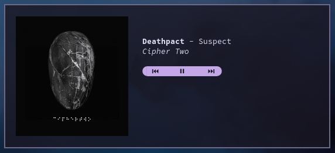

# Yet Another Media Controller
#### (Probably—I never checked for others.)

***

TUI for displaying information about and controlling currently playing media.



### Usage

Use <kbd>←</kbd> and <kbd>→</kbd> to skip to the previous and next track, respectively, and <kbd>Space</kbd> to play/pause. The onscreen buttons can also be clicked. 

The screen can be refreshed with <kbd>R</kbd> if need be.


### Configuration

The configuration file is located in `~/.config/yamc/yamc.ron`. An example can be found at https://github.com/lilithium-hydride/yamc/blob/master/yamc.ron.


### Obtaining

#### Runtime Dependencies
* [Chafa](https://github.com/hpjansson/chafa/) is required to display cover art.

Binaries are not currently provided, so you'll have to build the project yourself.
```sh
git clone https://github.com/lilithium-hydride/yamc
cd yamc
cargo +nightly build --release
curl https://raw.githubusercontent.com/lilithium-hydride/yamc/master/yamc.ron -o $XDG_CONFIG_HOME/yamc/yamc.ron --create-dirs
./target/release/yamc
```


### Known Issues

* Very rarely and seemingly at random, it will bug out and print stuff off on the right side of the window once before returning to normal. This can be cleared with <kbd>R</kbd> for the time being.